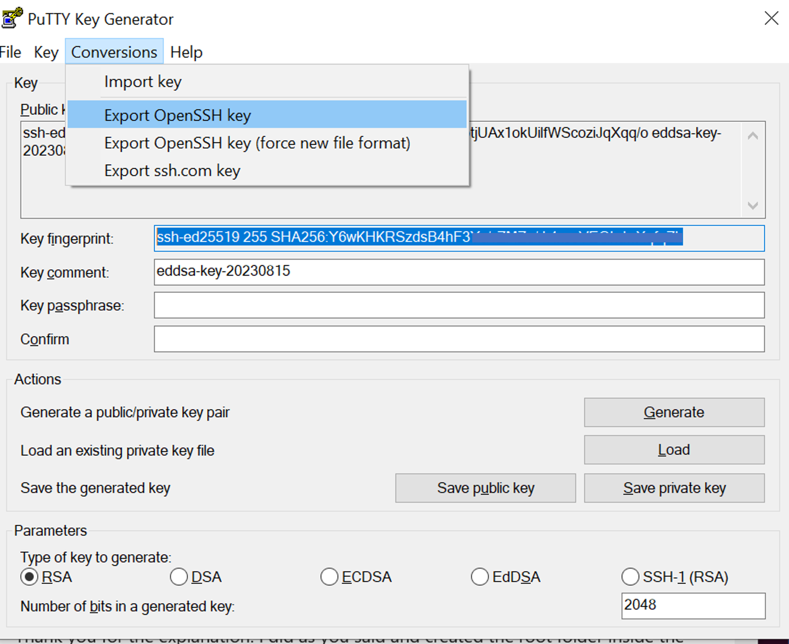
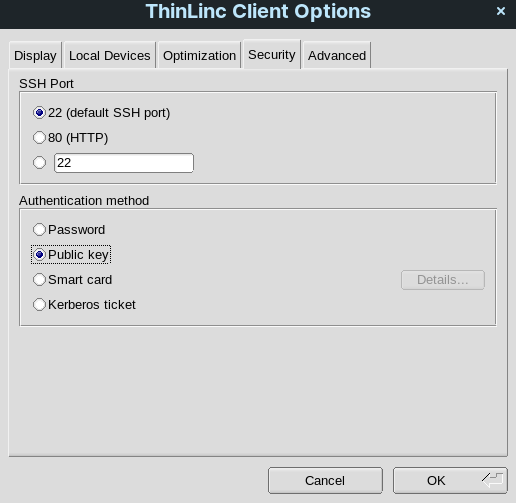
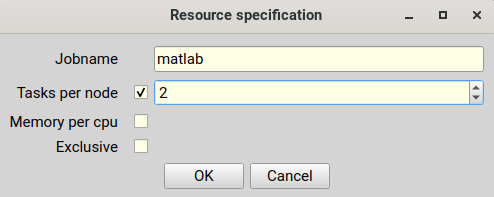
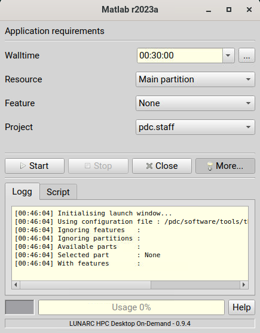
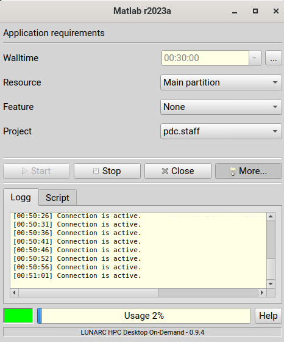
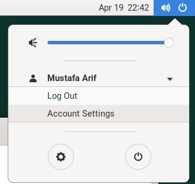

# Interactive HPC at PDC

## Please note that at the moment Thinlinc is not in production yet  only in pilot phase!

### Introduction

Interactive HPC enables scientific users to run scientific computations interactively using remote desktop environment and interactive job launcher.

### What is ThinLinc?

ThinLinc is a remote desktop program developed by Cendio which allows users to connect to a remote server using a ThinLinc Client. It uses ssh for authentication and VNC for graphics. ThinLinc has two main components, Server and Client. Thinlinc server is setup by PDC admins to enable remote desktop environment. ThinLinc client which is available for Linux, Mac and windows can be installed by users on their laptop or desktop.

## How ThinLinc can help in my computation?

A user connecting to ThinLinc server is presented with a remote desktop graphical environment where they have access to graphical applications, utilities, terminal etc. Users can create or update their files on Lustre file system, Submit interactive jobs to SLURM and can use interactive job launcher ‘gfxlauncher’ to start various graphical applications e.g. Matlab, RStudio, Mathemtica etc. and Jupyter Labs/Notebooks on Dardel.

### What is gfxlauncher?

Gfxlauncher is an application written in Python which provides users an interactive way to launch GUI applications and submit SLURM jobs. It is developed at LUNARC, Lund University Sweden. Gfxlauncher runs on top of ThinLinc to assist users in launching interactive jobs such as Jupyter Notebooks, Matlab, RStudio etc.

### Getting started with interactive HPC

Users should download ThinLinc client (tlclient) which is required to connect to remote ThinLinc server. Depending upon which operating system you are using, you can download relevant installation media from [Cendio download page](https://www.cendio.com/thinlinc/download/). Once downloaded, run the installation and follow the installation dialog box.

### Authentication in ThinLinc Client

ThinLinc client supports multiple authentication methods. Kerberos and SSH Key based authentication is currently supported at PDC. If you are using Windows Operating system, you can only use SSH key based authentication. For Linux and Mac users, you can use Kerberos or ssh key based authentication.

**Step 01:** Launch ThinLinc Client and enter Thinlinc server address and your PDC username. Please also check the box *End existing session*.

<!-- note..

Do not enter your password in this dialog. Either choose Kerberos or SSH Keybase authentication as described in step 03. -->

**Step 02:** Click on Options -> Security Tab

**Step 03:** Choose type of authentication, either Kerberos or Public Key.

> Read more about Kerberos Authentication [How to log in with kerberos](kerberos_login.md) and for ssh keybased authentication [How to log in with SSH keys](ssh_login.md)

**Notice for Windows system**:

1. You can only use *Public Key*  authentication to connect the Thinlinc server on Windows system.
1. The ThinLinc client uses OpenSSH for ssh communication with the server, that means that it cannot support *PuTTy* generated private keys. You have to convert the  *.ppk* to OpenSSH format, this can be done with *PuTTYGen* by loading the private key and then clicking “Conversions” to “Export OpenSSH key”. You can also use the private key generated by command *ssh-keygen* in *MS cmd*



## Kerberos Authentication

For Kerberos authentication, obtain Kerberos ticket in terminal and then connect to ThinLinc server.

```text
kinit username@NADA.KTH.SE
klist
```


## SSH key based authentication

For SSH keybased authentication, choose Public Key option in security and provide path to private key.



**Step 04:** Once you have chosen the required authenticaiton method. Click Ok and return to main window of ThinLinc client. Click Connect!

!!! note 

    Currently there is a software bug which prompts for password authentication once you have connected to ThinLinc. You can press cancel on this dialog.


### Launching Interactive jobs from Menu

GUI applications available on Dardel are already integrated in Remote Desktop Menu system. Users can launch Graphical applications and Jupyter Notebooks/Lab on Dardel interactively.

## Graphical application on Dardel

Applications which have a graphical interface such as Matlab, Mathematica etc. can be launched interactively using gfxlauncher.

* Click on Applications -> PDC-Apps and click on required application


* gfxlauncher menu will appear where you can choose various options for this application


* Click on three dots to choose resources e.g. Jobname, Tasks per node and memory


* View logs for gfxlauncher by clicking ‘More’


* View Job Script which will be submitted for this interactive job


* Start job by clicking ‘Start’ button and review progress in log tab.



## Launching Jupyter Lab and Jupyter Notebook

You can interactively launch Jupyter Lab and Notebook on Dardel by following the steps as below;

**Step 01:** Click on Applications -> PDC-Jupyter -> Jupyter Lab or Jupyter Notebook


**Step 02:** Configure your job parameters in the dialog box.


**Step 03:** Click Start, wait for the job to start and in few seconds a firefox browser will open with Jupyter Lab or Notebook session.
If you close the firefox browser, you can connect to same Jupyter session again by clicking ‘Reconnect to Lab’.


!!! note

    Please note that we currently do not support custom Anaconda Environments for Jupyter Notebooks and Lab launched via interactive job launcher. This is work in progress and will be made available soon.

### Launching interactive jobs from Terminal

If your application is not integrated in menu system, you can still run such application interactively via terminal in Remote desktop environment.

* Request for node allocation and note down the allocated nid number e.g. nid00xx

```text
salloc --ntasks=2 -t 01:00:00 -p shared --qos=normal -A <project>
```

* Login to allocated node

```text
ssh -X nid00xx
```

* Load application module and launch

```text
module load PDC
module load matlab/2022a
matlab
```

### How to exit from ThinLinc Session

## Disconnect or Logout

If you don’t have application running in remote desktop environment, please logout from current sesssion by selecting Logout as shown below to free up ThinLinc licenses for someone else.



If you simply close your ThinLinc client, your session will continue to run on server. You can then reconnect via ThinLinc client and same session will resume. This however is not recommended if you don’t have any active application running on the ThinLinc node since this uses up ThinLinc licenses.

### FAQ s

1. Menu structure in ThinLinc client is not working as expected, what should I do?

   When you connect to ThinLinc, a special script runs and generates up to date menu entries under your home directory. These menu entries may become outdated. You can simply issue following commands in terminal to clear up current menu entries and log out / log in again to ThinLinc session to recreate updated menu structure.

```text
rm ~/.local/share/applications/gfx-*
rm ~/.local/share/desktop-directories/*
```

1. How can I request to add additional applications in Menu Integration?

   You can always open a service request at PDC to request for additional applications to be intergrated in menu system.
1. What will happen if I close ThinLinc session?

   You current session and applications will continue to run.
1. I am getting license error, what should I do?

   We currently have 10 ThinLinc client licenses. This means 11th user connecting to ThinLinc will get License error. You can reconnect after sometime to see if license becomes available. If this happens quiet often, you can send in a support request for us to consider increasing ThinLinc client licenses.
1. How to use custom anaconda environment for Jupyter Notebooks with gfxlauncher?

   This is currently work in progress and will be implemented soon.
