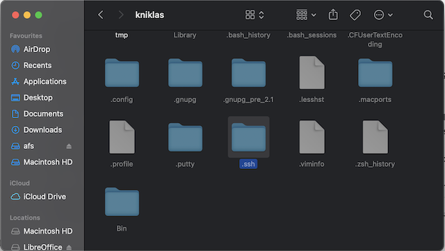
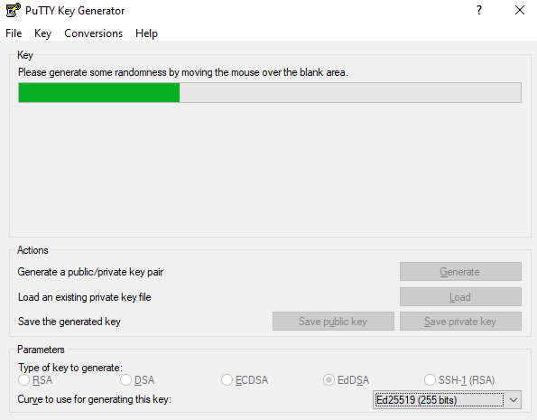
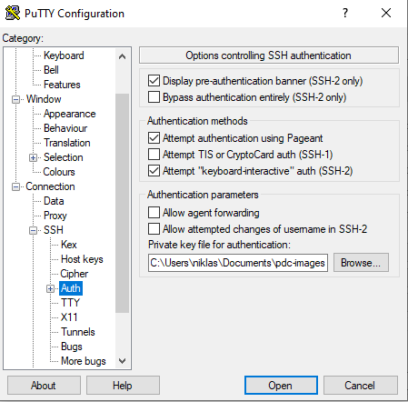
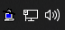

# Generating SSH keys

This is a guide on creating SSH keys for use with Dardel. Acceptable key types are **ed25519 (EdDSA)** and **rsa**.

## macOS

Open a Terminal window. You can access this by opening Finder, selecting Applications, then the Utilities folder, and double-click Terminal within there. As an alternative open Launchpad, search for Terminal and double click on the Terminal application.


First, make sure you have a .ssh directory in your home directory by typing these commands in Terminal:

```text
cd
```

```text
mkdir .ssh
```

```text
chmod 700 .ssh
```

You can generate a key pair using this command in your terminal:

```text
ssh-keygen -t ed25519 -f ~/.ssh/id-ed25519-pdc
```

You may set a passphrase at your discretion, but will then have to enter it every time you use the key unless you load it in an agent. If you don’t want to use a passphrase just press return on the passphrase question.

This will generate an EdDSA key pair in .ssh under your home directory. The public key will be **id-ed25519-pdc.pub** in the same directory and can be registered with PDC.

After registration you will be able to log in to Dardel with the following command:

```text
ssh -i ~/.ssh/id-ed25519-pdc <username-at-pdc>@dardel.pdc.kth.se
```

If you’d like to use this as your default key for Dardel, you may edit “.ssh/config” under your home directory and add this line:

```text
Host dardel.pdc.kth.se
   IdentityFile /Users/<myuser>/.ssh/id-ed25519-pdc
```

(If .ssh/config does not exist, simply create it.)
<myuser> should be substituted with your actual username on the Mac.

To find your home directory, go to the Terminal and enter:

```text
cd
```

```text
pwd
```

This should give you “/Users/<myuser>”

To reach .ssh/config, go to Desktop in Finder, press Cmd+up arrow, press Cmd+Shift+. (period), then double-click the .ssh folder that appears.
The command Cmd+up arrow, press Cmd+Shift+. makes dot files visible.



## Linux

Open a terminal, then please use the macOS instructions as the procedure is similar, although for .ssh/config in your home directory will likely be under /home and not /Users.

## Windows

For PuTTY, make sure it is installed according to the instructions: [Install and configure Kerberos and ssh for Windows](windows_login.md#install-and-configure-kerberos-and-ssh-for-windows). For WSL or Cygwin based login, please follow the macOS/Linux instructions.

For PuTTY, run PuTTYgen, which if you used a PuTTY installer should be searchable from the start menu.


Make sure EdDSA is selected at the bottom with 255 bits. Then click “Generate”.



Move the mouse randomly within the blank field as instructed until done.


Optionally set a key comment, so you can identify the key later. You can also set a passphrase but will then have to enter it every time you use the key or load it into an agent. You can copy the public key from the “Public key for pasting…” field to register with PDC.

Make sure to save your private key in a location where you can find it later and is not accessible to other users. You can also load this private key into PuTTYgen later to access the public key in OpenSSH format. The format saved by “Save public key” is not compatible with PDC, so you must use the key from “Public key for pasting…”



To use your key with PuTTY, you can either do as in the image above (the “Private key file for authentication” field - this will save it with your session) to load it directly into PuTTY…

or you can start Pageant, the PuTTY agent.



Right-click on the computer with the hat in the system tray, select “Add key, “ and then load your private key. As long as the agent is running, the key will be accessible to PuTTY without further configuration.
