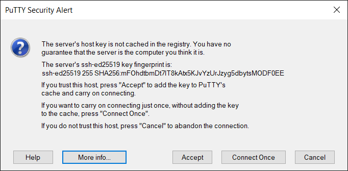

# How to log in with SSH keys

In order to be able to login into PDC system, the user needs a PDC account, and this PDC account must be linked
to your [SUPR](https://supr.naiss.se/) account.
Users can upload their SSH (Secure Shell) public keys with the PDC login portal and then use them to log in to PDC resources.
Before following this section, make sure you have a valid PDC account ([Getting Access](../getting_access/get_access.md)).
Login to PDC systems will be denied without a valid allocation.

Academic and industrial users connected to the Swedish academia can upload their SSH (Secure Shell) public keys on the PDC login portal and
authenticate themselves with the help of the Swedish User and Project Repository [SUPR](https://supr.naiss.se/).
Registered SSH key pair login is restricted by user-defined IPs, and SSH keys have to be renewed regularly.
After setting up all details in the login portal the user will be able to login from the chosen IP addresses with SSH for the selected validity period.

## How SSH key pairs work

Authentication using SSH asymmetric key pairs is very common. Each SSH key pair includes two keys: a public key and a secret key. The public key should be copied to the SSH server. Anyone with a copy of the public key can encrypt data which can then only be read by the person who holds the corresponding private key. The private key must remain with the user and should be kept secret.
The server uses the public key to encrypt a message and send it to the client. If the client, on the user side, has the correct private key, it can decrypt the message and send it back to the server for verification.

## How to create SSH key pairs

It is recommended to create a new SSH key pair for every new purpose/resource. Keep in mind to protect the private part of your SSH key pair and only share the public key. Supported SSH key types are **ed25519 (EdDSA Elliptic Curve, recommended)** and **rsa**.

Follow the instructions on how to generate an SSH key pair, see [Generating SSH keys](ssh_keys.md).

Once you have successfully produced a working SSH key pair you let your browser open the
[PDC login portal](https://loginportal.pdc.kth.se/).

## Authentication process details

SUPR authentication is used to initially set up the communication between the user’s computer and the PDC system, making sure that security is maintained at all times.
After the initial setup, the login portal will only be needed to manage and change the user’s connection information, e.g. after the expiration date had passed or if the user logs in from an IP-address outside the user’s registered IP ranges.

* Go to [PDC login portal](https://loginportal.pdc.kth.se/). You will see a start page with a link to the Swedish User and Project Repository (SUPR).
* Click on the SUPR link.
* Login to SUPR. SUPR does not use the same password as the one you received from PDC. If you have not previously set up a SUPR password, you can log in with SWAMID.
* By default PIs, staff and administrators will be asked to authenticate themselves with a second factor, a Time-based One-time Password (TOTP).
  : Any TOTP authentication app such as e.g. andOTP, FreeOTP, Authy, Google Authenticator or Duo Mobile can be used.
    Use the same app as you used when you registered for the first time for SUPR two-factor authentication.
* Click on the blue ‘Prove My Identity to PDC’ button. If you get a “Permission Denied” error it may be because your PDC and SUPR accounts are not linked. Please contact PDC support.

## In the login portal


Once you have successfully authenticated yourself you should be back to the login portal.
Your personal information should be displayed together with the details of the login credentials you already registered.
If you want to register a new key:

### Click on ‘Add new key 


* Upload or copy and paste the **public!** part of your SSH key pair (usually with extension .pub). (Tip: If you don’t see the  *.ssh* directory try toggling the visibility of dot files with e.g. pressing *Ctrl + h* in Linux or *shift + cmd + ‘.’* for MacOS.)
* Name the label or in case the label came from a .pub file you can also rename the label. Labels are for your personal reference only, but you can’t use the same label twice.
* The IP address from where you are connected as seen from the portal will already be shown in the address field as a default. A significant bit mask of between /24 and /32 or a domain-name based range can be added to the IP address.
* For the expiration date, the maximum allowed value is shown. The user can chose any value between now and this maximum value.
* Once you have filled in all the fields, Press **Save**.

You now get back to the page with personal information in the login portal. You can also add further IP addresses, IP address ranges or domain-based address ranges to existing keys, as well as delete IP addresses or address ranges from keys. One key can have several different IP addresses and address ranges. A key will need to be restricted in the (IP) address range to be considered valid.

Several keys can be added in the PDC login portal. You can add further keys or delete keys. If you want to add a short term entry for the same key, you can upload the same key again and restrict it to a different IP address or address range with a different expiry date.

## Log in to PDC resources

Once your SSH public key is properly registered, you can login from a terminal, or by using Putty.

### Linux and mac OS

Open a terminal to login with

```text
ssh dardel.pdc.kth.se
```

or if your user name on the system you log in from differs from your username at PDC:

```text
ssh <username-at-pdc>@dardel.pdc.kth.se
```

When connecting for the first time, your ssh client will write:

*The authenticity of host ‘dardel.pdc.kth.se (130.237.230.204)’ can’t be established.*

and display an ED22519, ECDSA, or a RSA key fingerprint. You should then compare that the fingerprint matches with one of the fingerprints stated on this webpage.

### Windows

To log in with Putty, first follow the instructions on how to generate an SSH key pair, see [Generating SSH keys](ssh_keys.md) and register the public key.

You can then log in to Dardel by specifying *dardel.pdc.kth.se* as Host Name in the Putty main window.


When connecting for the first time, Putty will display the alert



You should then compare that the key fingerprint matches with one of the fingerprints stated on this webpage.

### Key fingerprints

The key fingerprints are hashed with either an SHA256 hash function, or an MD5 hash function.

SHA256 hashes of key fingerprints

```text
ED25519 key fingerprint is SHA256:mFOhdtbmDt7lT8kAtx5KJvYzUrJzyg5dbytsMODF0EE
ECDSA key fingerprint is SHA256:qisSXP26ai1ZJuTywX+6eZia7W9RgqFhrnvRSx1fyLg
RSA key fingerprint is SHA256:7sysEJ5Gbbjjr3ITLxNZR8IUXfxTqmJ+Y3p0gDhpyCI
```

MD5 hashes of key fingerprints

```text
ED25519 key fingerprint is MD5:84:2d:b2:67:bd:2a:0a:e7:4e:bd:9a:57:32:41:d8:8b
RSA key fingerprint is MD5:15:e7:9e:4a:42:4d:61:29:dd:a3:2c:b9:b3:ef:e0:9d
ECDSA key fingerprint is MD5:8c:62:70:4c:b8:f2:c4:ab:14:43:b7:31:ba:c3:c9:52
```

## Users which do not have a SUPR account

For users without SUPR account currently only Kerberos login is officially supported. If you are in SUPR, but your SUPR account is not properly linked to PDC, please contact PDC support ([support@pdc.kth.se](mailto:support@pdc.kth.se)).

## Configuring ssh keys and kerberos login

It is possible to have both authentication methods enabled at the same time and use whichever one you prefer when connecting.
If you have configured your **config** file according to instructions on the [SSH](configuration.md#ssh) page
you need to add the following **before** your kerberos configuration in the config file.

```text
Host dardel.pdc.kth.se
  Preferredauthentications publickey
  IdentityFile ~/.ssh/<PRIVATE SSH FILE>
```

In case you have not done any changes to your config file or if you do not have a config file, then everything should
work regardless of which login method you are using.

## Debugging

If you experience any problems logging in via your newly registered key, you should contact PDC Support ([support@pdc.kth.se](mailto:support@pdc.kth.se)).

If you already experience problems during the authentication process it might help to start a new private window in the browser with fresh settings.

If you are interested, you can log in with Kerberos and check the current information about you in PDC’s local LDAP directly on the login Node.

```text
ldapsearch -x -b uid=`whoami`,ou=users,ou=dardel,dc=pdc,dc=kth,dc=se
```

There you can also check the cached authentication information about you:

```text
sss_ssh_authorizedkeys `whoami`
```
