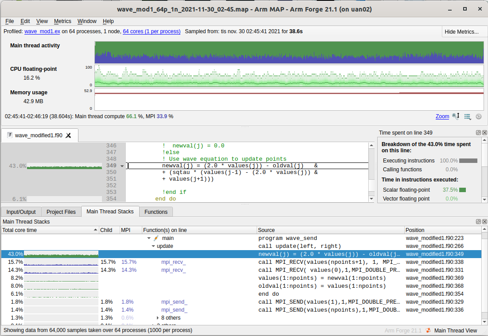

# Linaro-forge

## Installed versions

| Resource | Version |
|---|---|
| Dardel/cpe23.12 | 24.0 |

## General information

Linaro Forge (formerly ARM Forge) is the complete toolsuite for software development - with everything needed to debug, profile, optimize, edit and build C, C++, Fortran and Python applications on Linux for high performance - from single threads through to complex parallel HPC codes with MPI, OpenMP, threads or CUDA.
For more information see:
https://www.linaroforge.com/

# Linaro DDT
Linaro DDT is the debugger for software engineers and scientists developing C++, C and Fortran parallel and threaded applications on CPUs, GPUs and Intel Xeon Phi coprocessors.
It is also possible to debug Python code.
Its powerful intuitive graphical interface with automatic detection of memory bugs, divergent behavior and lightning-fast performance at all scales combine to make Linaro DDT the number one debugger in research, industry and academia.

## Linaro MAP
Linaro MAP is a profiler that shows you which lines of code are slow and gets everything else out of your way.
Whether at one process or ten thousand, Allinea MAP is designed to work out-of-the-box with no need for instrumentation and no danger of creating large, unmanageable data files.  Software engineers developing parallel and threaded applications on CPUs, GPUs and Intel Xeon Phi coprocessors rely on Linaro MAP's unrivalled capability.

## How to use

Load the the Linaro-forge 24.0 suite 
```
$ module load PDC
$ module load linaro/24.0
```
To prepare code for MAP or DDT, just compile with debugging enabled 
```
$ ftn -g sourcecode.f90 -o prog.ex
```
The binary ``prog.ex`` is now instrumented for Linaro MAP (and DDT).
In order to run you must prepend the *srun* command in your bash script or interactive run with *map --profile*.
Here is a simple script:
The run will generate an additional file next to the normal output of the mapped application, namely:
<app>_<cores>p_<date-stamp>_<time-stamp>**.map**
You can open the **map** file in Linaro-forge GUI.
(you must have x11-forwarding enabled in your logged in session)

# Running example for map
We will here demonstrate an example from the official documentation
that has been lightly profiled and optimized by us 
```
$ mkdir forge-test
$ cd forge-test
$ cp -r /pdc/software/23.12/other/linaro-forge/24.0/examples/wave_demo_TKL .
```
This example implements the concurrent wave equation. A vibrating string
is decomposed into points and distributed to the processors who update
local slices of the string. End points of each slice is communicated to the
neighbors between iterations.
There are three fortran source codes 
```
$ wave_modified0.f90
$ wave_modified1.f90
$ wave_modified2.f90
```
where 0 indicates original example and 1,2 are updates where identified
bottlenecks have been handled.

## Light profiling of original code to identify bottlenecks

```
$ ftn -g examples/wave_modified0.f90 -o wave_mod0.ex
```
Submit a job of a binary compiled from *wave_modified0.f90*. When finished, open the resulting **.map** file in the gui
$ map wave_mod0_64p_1n_2021-11-30_01-58.map


Here we see that total run time is **79s** and **99.9%** of the time is spent in the subroutine update().
Clicking this field gives us a detailed view of where this time is spent.


The 46.6% post is not so much to do about in terms of rearranging operations. But two others can easily be modified:
a. Line 345 can be moved outside the do loop. (8.8% of the time)
b. Line 356-357 are better to turn into vector operations. (13.2% and 3% of the time)
In wave_modified1.f90 these parts have been modified. Let's compile this file and run the binary.



The total time is now **38s**. Interestingly, the slowest part went from 36.8s (46.6%) to 16.3s (43.0%)
without seemingly touching it. However, note that we eliminated the if-else statement that previously
was done at each iteration of the inner do loop.
Note also for previous line 345 and 356:
a. Below 0.1% execution time now.
b. Went from 10.4s (13.2%) and 2.4s (3%) to 3.0s (8%) and 3.0s (8%).
The last part is now slower than the previous due to memory access - in the original code line 357 benefitted
from line 356 where data had already been fetched. Overall performance is however still faster now.
Now we turn to the next posts - (15.7%) on line 338 and (14.3%) line 331. These are places where the processes
are *waiting* to receive (MPI_recv) for the endpoints from their neighbors. However, one may observe that the
bulk of time in line 349 in the original code can actually be performed immediately - all points except the end points.
We separate these from the loop and use non-blocking MPI_Isend to match the moved MPI_Recv.


Now we see that the waiting time for the processes were reduced to (8%) while the total time is now **37s**.
In absolute terms, no big difference but this last step still illustrates how one can use non-blocking
routines to fine-tune design.

